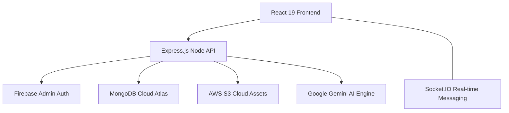

<p align="center">
  
  <h1 align="center">📚 StuNotes — The Ultimate Study Hub</h1>
  <p align="center">
    <b>A professional-grade, AI-powered platform designed for modern student collaboration.</b><br />
    Effortlessly share notes, join study huddles, and challenge your knowledge with AI-generated assessments.
  </p>
</p>

<p align="center">
  
  
  
</p>

---

## 🚀 The Vision
**StuNotes** is more than just a note-sharing app; it’s an intelligent ecosystem for learners. It bridges the gap between solitary study and social learning by combining **High-Authority UI Design** with **Real-time Communication** and **Google Gemini AI**.

## 🛠️ Architecture Overview
Designed with scalability and security as core pillars:



## ✨ Premier Features

### 🧠 AI Academic Assistant
*   **Gemini 2.0 Integration**: A context-aware chatbot for deep academic inquiries.
*   **Automatic Grading**: Subjective answers are graded by AI to provide nuanced feedback.

### 🏘️ Smart Study Groups
*   **Isolation & Huddles**: Create private group huddles or participate in public subject-based communities.
*   **Persistent Chat**: Real-time messaging with Socket.IO, including message editing and deletion.
*   **Voice Transmissions**: Share audio notes directly within your study group.

### 📝 Dynamic Assessments
*   **AI Question Generation**: Convert your uploaded notes directly into interactive practice quizzes.
*   **Progressive Leaderboards**: Gamified performance tracking to motivate improvement.
*   **Focus Mode**: A distraction-free environment for taking timed assessments.

## 💻 Technical Stack

| Layer | Technologies |
| :--- | :--- |
| **Frontend** | React 19, Vite, React Router 7, Recharts, Firebase SDK |
| **Backend** | Node.js, Express 5, Socket.IO, Firebase Admin SDK |
| **Intelligence** | Google Gemini (Generative AI), PDF-Parse, Mammoth |
| **Storage** | MongoDB Atlas (NoSQL), AWS S3 (Blob Storage) |
| **Stying** | Vanilla CSS (Premium Glassmorphism), Lucide/React-Icons |

## 📁 Repository Structure

```text
├── backend/
│   ├── src/
│   │   ├── config/          # Configurations for S3, Firebase, Mongo
│   │   ├── controllers/     # API Logic & Route Handlers
│   │   ├── middleware/      # Auth & File Upload Logic
│   │   ├── routes/          # REST Endpoint Definitions
│   │   └── sockets/         # Real-time Event Handlers
│   └── index.js             # Server Entry Point
├── frontend/
│   └── src/
│       ├── features/        # Component-based logic (Notes, AI, Groups)
│       ├── services/        # Axios & Firebase API clients
│       └── shared/          # Reusable UI Patterns
└── README.md                # Project Documentation
```

## 🔐 Security & Integrity
Following a rigorous security audit, the platform includes:
- **Server-Side Token Verification**: Every request is authenticated via Firebase Admin SDK.
- **Resource Ownership**: Users can only modify or delete their own notes and assessments.
- **Encrypted Environment**: All sensitive keys are managed through isolated `.env` configurations.

---

## 📥 Getting Started

### Prerequisites
- Node.js (v18+)
- MongoDB Atlas Account
- AWS Account (S3 Bucket)
- Firebase Project

### Installation

1. **Clone the Repo**
   ```bash
   git clone https://github.com/your-username/stunotes.git
   cd stunotes
   ```

2. **Backend Setup**
   ```bash
   cd backend
   npm install
   # Create .env with MONGO_URI, AWS_KEYS, GEMINI_KEY
   npm run dev
   ```

3. **Frontend Setup**
   ```bash
   cd frontend
   npm install
   # Create .env with Firebase Config
   npm start
   ```

---

<p align="center">
  Built for students, by students. <br/>
  <b>Revolutionize your learning experience with StuNotes.</b>
</p>
